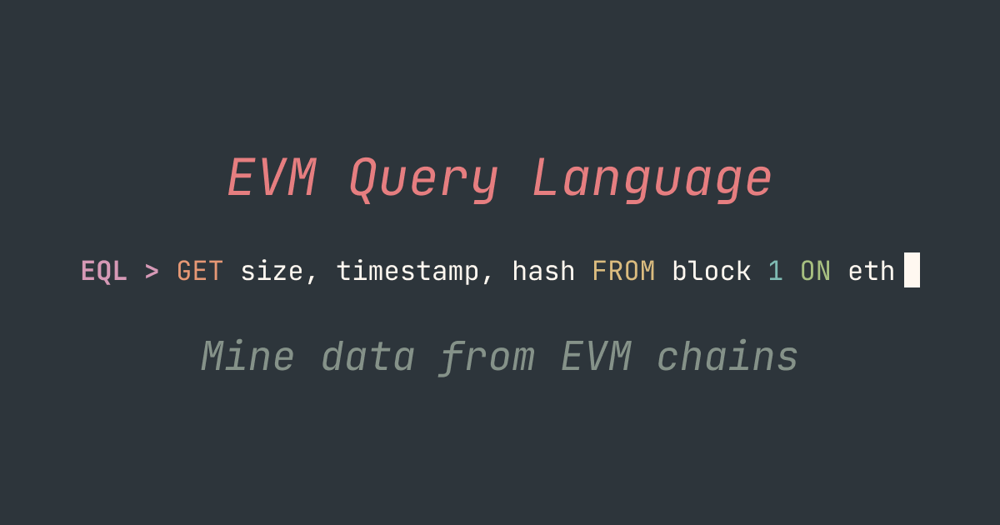
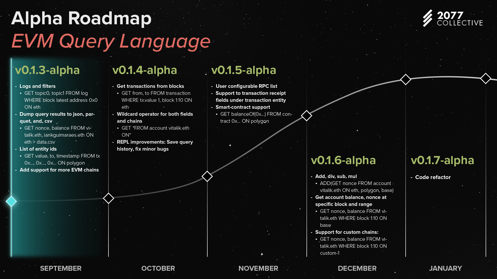

# EVM Query Language (EQL)


> A SQL-like language for querying EVM chains with minimal boilerplate.


[](https://github.com/iankressin/eql/actions/workflows/tests.yml)


EQL provides a declarative way to query Ethereum Virtual Machine (EVM) chains. It enables developers and researchers to fetch blockchain data using familiar SQL-like syntax, eliminating the need for complex boilerplate code.

```sql
# Fetch Vitalik's balance across multiple chains
GET balance, balance FROM account vitalik.eth ON eth, base, arbitrum
```

## Table of Contents
- [Why EQL?](#why-eql)
  - [The Problem](#the-problem)
  - [The Solution](#the-solution)
- [How It Works](#how-it-works)
- [Quick Start](#quick-start)
  - [Installation](#installation)
  - [Usage](#usage)
    - [CLI Mode](#cli-mode)
    - [Library Mode](#library-mode)
    - [Web Mode](#web-mode)
- [Features](#features)
  - [Supported Entities](#supported-entities)
  - [Supported Operations](#supported-operations)
- [Documentation](#documentation)
- [Roadmap](#roadmap)
- [Contributing](#contributing)
- [License](#license)

## Why EQL?

### The Problem

Querying EVM chain data traditionally requires:
- Writing extensive boilerplate code
- Managing multiple RPC provider connections
- Handling rate limits and retries
- Dealing with different response formats

### The Solution

EQL abstracts away the complexity by:
- Providing a simple, SQL-like syntax
- Managing RPC connections under the hood
- Handling data formatting automatically
- Supporting cross-chain queries in a single line

## How It Works

EQL uses a two-phase interpreter to transform your queries into RPC calls:

1. **Frontend Phase**
   - Tokenizes and parses your query
   - Validates syntax and semantics
   - Builds an Abstract Syntax Tree (AST)

2. **Backend Phase**
   - Maps AST to appropriate JSON-RPC methods
   - Manages concurrent RPC requests
   - Formats responses into consistent structures

For example, this query:
```sql
GET balance, nonce FROM account vitalik.eth ON eth
```

Gets transformed into:
1. ENS resolution for "vitalik.eth"
2. `eth_getBalance` RPC call
3. `eth_getTransactionCount` RPC call
4. Results formatting into a structured response

## Quick Start

### Installation

```bash
# Install EQL version manager
curl https://raw.githubusercontent.com/iankressin/eql/main/eqlup/install.sh | sh

# Install latest EQL version
eqlup
```

### Usage

#### CLI Mode
```bash
# Run a query file
eql run query.eql

# Interactive REPL
eql repl
```

#### Library Mode
```toml
# Cargo.toml
[dependencies]
eql_core = "0.1"
```

```rust
use eql_core::interpreter::Interpreter;

async fn main() {
    let query = "GET balance FROM account vitalik.eth ON eth";
    let result = Interpreter::run_program(query).await?;
}
```

#### Web Mode
[https://eql.sh](https://eql.sh)

## Features

### Supported Entities
- **Accounts**
- **Blocks**
- **Transactions**
- **Logs**

### Supported Operations
- **GET**: Query entity data
- **Filtering**: WHERE clauses for precise queries
- **Cross-chain**: Query multiple chains in one go
- **Data Export**: CSV, JSON, Parquet formats

## Documentation

For detailed documentation on queries and installation:
- [Query Syntax Guide](./docs/query.md)
- [Installation Guide](./docs/installation.md)

## Roadmap



See our detailed [Roadmap](./docs/roadmap.md) for upcoming features.

## Contributing

We welcome contributions! See our [Contributing Guide](./CONTRIBUTING.md) for details.

## License

MIT License - see [LICENSE](./LICENSE) for details


